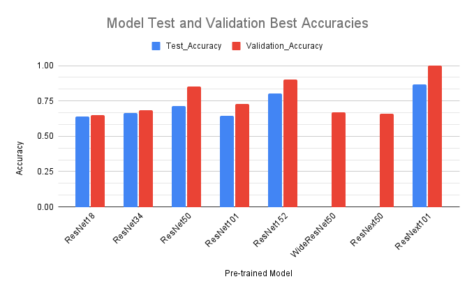
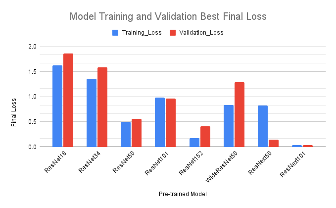

#### Donna Albee (albeed), Sam Lewis (sameul26), Annalice Ni (anni00), Eric Yoon (yoone2)

### Context

<iframe width="560" height="315" src="https://www.youtube.com/embed/liIlW-ovx0Y" title="YouTube video player"
    frameborder="0" allow="accelerometer; autoplay; clipboard-write; encrypted-media; gyroscope; picture-in-picture"
    allowfullscreen></iframe>

### Introduction

##### The Problem

What are birds?

Seemingly everywhere, birds can be found at almost any time of the day. Their tweets can wake you up at the crack of dawn, they can be found assailing innocent passersby for food around noon and seen crowing ominously in the trees at dusk. Yet how do you identify birds? What is the difference between a crow and a raven? Do birds even exist?

These deep philosophical questions are what prompted us to work on classifying different bird species for our final project. Through the Birds! Kaggle Competition, our goal was to train a model that would classify birds in an image. This would allow us to answer important questions like

> How do you tell the difference between an African and European swallow?

And many more!

##### Datasets and Data Augmentation

For our dataset, we used the Bird Dataset provided by the Birds! Classification Kaggle Competition by Joseph Redmond. This dataset has approximately 50,000 images in it and 555 unique classes of birds. When processing images, we used both 224 x 224 and 128 x 128 images, as well as random modifications to images to diversify our training set. The transformations included cropping images and flipping images.

### Approach

##### Techniques

We were unfamiliar with the Pytorch image classification networks, so we tried running as many as possible to see what kind of different results we would get.

We decided to use the following models:

* ResNet models (18, 34, 50, 101, 152)
* WideResNet50
* ResNext models (50, 101)

Based on the list of torchvision models [here](https://pytorch.org/vision/stable/models.html) and also online blogs about image classification training, the accuracy of these groups of models were some of the highest of the ones provided. They were also similar in architecture, so it made sense to compare their experimental results. ResNet18 was the model used in the demo code provided in class, so we started with that model.

After training and testing a few models, we realized that it would be necessary to create a validation set in order to get an idea for what our test accuracy may look like after every epoch of training. We created a validation dataset using 20% of the training dataset, and changed it to 10% later when we realized that taking too much of the training dataset to use as a validation set affected the accuracy of the models.

We also attempted to combine the results of multiple models to try and increase accuracy overall. After making predictions on different models and submitting to see  test accuracy, we selected some of the highest-accuracy models. Using the predictions from these models, we combined the predictions for each image by picking the mode class from all the predicted classes. If there were multiple modes, we picked the class from the highest-accuracy model. This did not work very well, which we will discuss in a later section.

##### Problems

1. Overfitting was the main problem we encountered when training our models as the training loss would often be >0.4 less than the validation loss for a given epoch, and the test accuracy was lower than the reported validation accuracy. We tried a few strategies to mitigate this effect, and were mostly successful at finding a good set of hyperparameters to train a model with.

    Some strategies we tried were:

    * Scheduling learning rates to decrease as the number of epochs increased
    * Using larger image size (from 128x128 to 224x224)
    * Experimenting with weight decay
    * Using a smaller validation dataset (from 20% to 10% of training data)
    * Shrinking batch size

    Changes that made the most difference were using a larger image size and scheduling the learning rates. The accuracy improving when we used larger image sizes made sense since there would be more information for the models to train off of and predict with.

2. Another issue we found was that free Google Colab accounts did not have enough memory for the experiments we wanted to try. Initially, we resized images to be 128 x 128, however, when we tried to use larger images, the GPU would run out of memory. We were able to use images of size 244 x 244, but were unable to images larger than that. This was unfortunate, as larger images would have likely increased the accuracy of the model.

### Experiments and Results

##### Things we tried

We experimented with different pretrained models. We wanted to see what pretrained models worked best with bird classification. We tried models like ResNet, ResNext and WideResNet as well as different variations of each model. For each model, we also experimented with different hyperparameters. Adjusting things like learning rate, weight decay and validation set size allowed us to increase accuracy. Another thing we tried adjusting was image size. We initially used 128 x 128 images, but later switched to 224 x 224 images.

##### Best Overall

The model that performed the best overall was ResNext101. This was unsurprising since the model was an
advancement of the ResNet models and its accuracy shown in the torchvision documentation was one of the highest. We ended with a **86.6% test accuracy** when running ResNext101 on a 224x224 image size dataset with the following hyperparameters:

* Epochs: 28
* Learning rate schedule: 0:.01, 4:.001, 12:.0001
* Weight decay: 0.001
* Momentum: 0.9

##### Findings

We've included the following charts that show the best accuracies and lowest losses we ended up with for each model after trying different hyperparameters and epochs for each. We didn't get the test accuracy for a few of the models because we decided it wasn't worth submitting as the validaction accuracy wasn't high enough.

### Discussion

##### What did / did not work well and why

Models with greater model sizes don’t necessarily mean better performance. ResNext models all tended to perform with higher accuracy than any of the ResNet or WideResNet models. On top of this, Increasing the size of a ResNet model did not result in dramatic improvements. Instead, model training and memory requirements became much greater. A model of greater size also means high model complexity, which can potentially lead to overfitting and thus not affect accuracy much.

Using different types of models is more effective for improving general accuracy. ResNext outperforms the other models we tried by a considerable margin. ResNext adds a new style of transformation at each neuron which allows for the model to classify image data better than ResNet. Changing the structure of the model, rather than just adding more layers and neurons seems to be more efficient and effective at image classification.

Attempting to combine the results of multiple models did not work very well. For example, when we tried to combine the results of .86, .80 and .82 accuracy models, the resulting accuracy was .85. We think that this was because the models were not diverse enough. As such, combining results would not provide new information and resulted in a lower accuracy than the most accurate model

We could have been more scientific in our experiment approach. Early on in our testing, we changed many hyperparameters at once, like epoch size, learning_rate, and model type. It would have been a better approach scientifically to keep most hyperparameters as control, and changing only one at a time. When something seemed to work, we took the hyperparameters of that training session to use on a better model since we didn’t have infinite time to train each model on all the potential hyperparameters.

##### Learnings

ResNet has increasing model sizes, but they did not result in better accuracy. Switching to a different type of model like ResNext was much better for accuracy. These ResNet variations also took much more time and resources to train as the model sizes increased. If the same network architecture is used in a model, the size of the model doesn’t seem to impact the model performance as much as changing the dataset or using a different model.

Image quality affects accuracy more than hyperparameters or even model type since after switching from a 128x128 crop to a 224x224 crop, our models were able to achieve +10% accuracy. This makes sense since the dataset being trained on is improved and the model has more information to learn from.

##### Broader Applications

Using pretrained models and existing model architectures can achieve decently high performance in image classification without too much extra work from a user. This goes to show how powerful out-of-the-box networks can be for the average neural network enthusiast. We can use the same techniques of trying a variety of pre-trained models, tuning hyperparameters, and measuring validation and test accuracy to train models that can detect other animals and specific breeds, depending on the image dataset used.

### Resources we consulted

* [Demo code provided in class](https://colab.research.google.com/drive/1kHo8VT-onDxbtS3FM77VImG35h_K_Lav#scrollTo=yRzPDiVzsyGz)
* [List of torchvision models](https://pytorch.org/vision/stable/models.html)
* [A disciplined approach to neural network hyper-parameters](https://arxiv.org/abs/1803.09820)
* [This Model is for the Birds](https://towardsdatascience.com/this-model-is-for-the-birds-6d55060d9074)
